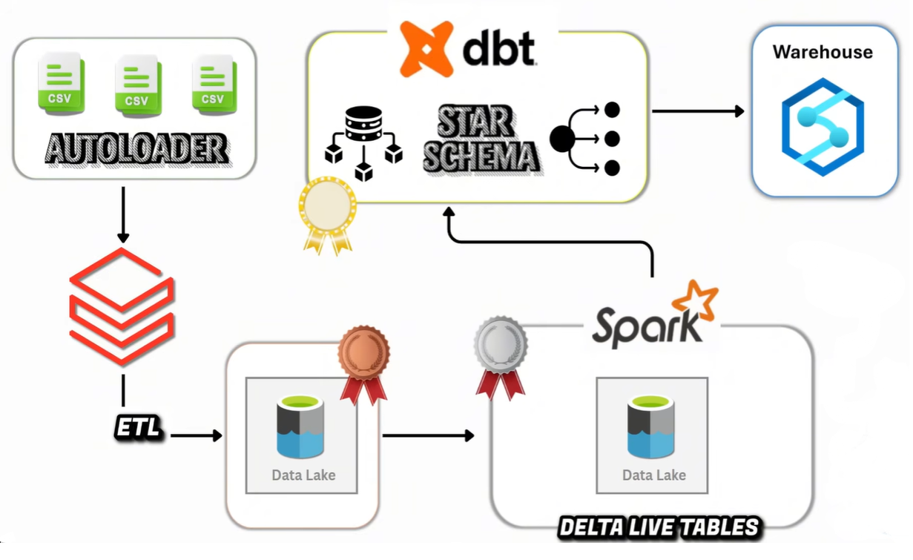

# End-to-End Data Engineering Project: Flights Data Warehouse with Databricks Medallion (Metallic) Architecture Methodology



## Overview

This project builds an end-to-end data engineering pipeline using **Databricks Free Edition** and the **Medallion Architecture Methodology** to process flights data and create a robust data warehouse. The pipeline ingests daily incoming files (e.g., CSV, JSON) into a **data lake** using **Databricks Autoloader** and **Spark Structured Streaming**, processes them through **Bronze**, **Silver**, and **Gold** layers, and constructs a **star schema** with one fact table (`FactBookings`) and three dimension tables, incorporating **Slowly Changing Dimensions (SCD) Type 1** for simply overwrite the existing record with the new value. **Lakeflow** (formerly Delta Live Tables) enables declarative data processing, and **DBT (Data Build Tool)** models create business-ready views. The final data warehouse is shared with end users and stakeholders via **Databricks SQL endpoints**.

The solution is dynamic, scalable, and reusable, leveraging parameterization, control flow, and automation to handle diverse file formats and incremental data, making it suitable for industrial-grade data warehouse projects.

## Pipeline Structure
1. **Bronze Layer**:
   - Autoloader ingests to `/Volumes/workspace/bronze/`
   - Categories: bookings, airports, customers, flights

2. **Silver Layer**:
   - Transforms via Delta Live Tables (DLT)
   - Creates 4 base tables + business view
   - Applies expectations on `silver_bookings`

3. **Gold Layer**:
   - `GOLD_DIMS.py`: Builds dimensions via SCD Type 1
   - `GOLD_FACT.py`: Creates `FactBookings` with dimension keys

## Medallion Architecture Methodology

### What is the Medallion Architecture Methodology?

The **Medallion Architecture Methodology** is a structured approach to building data pipelines in a **lakehouse** architecture, organizing data processing into three layers:

- **Bronze Layer**: Ingests raw data as-is from source systems (e.g., daily CSV/JSON files) with minimal processing, preserving original formats in **Delta Lake** for traceability and fault tolerance.
- **Silver Layer**: Cleans, standardizes, and enriches data, applying schema enforcement, deduplication, and transformations to prepare it for analytics.
- **Gold Layer**: Curates business-ready data, optimized for reporting and analytics, using a **star schema** with **fact** and **dimension** tables, including **SCD Type 1** for simply overwrite the existing record with the new value.

This methodology leverages Databricks features like **Autoloader**, **Lakeflow**, and **Delta Lake** to manage large-scale, incremental data processing efficiently.

### Other Data Engineering Methodologies

1. **ETL (Extract, Transform, Load)**:
   - Extracts data, transforms it in a staging area, and loads it into a data warehouse.
   - Best for structured data and relational databases but less flexible for big data or streaming.
2. **ELT (Extract, Load, Transform)**:
   - Loads raw data into a data lake before transformation, leveraging cloud compute for scalability.
   - Ideal for Databricks and lakehouse architectures, aligning with the Medallion Architecture Methodology.
3. **Data Vault**:
   - Uses hubs, links, and satellites for scalable, auditable data modeling.
   - Suited for complex enterprise data warehouses but requires significant upfront modeling.
4. **Lambda Architecture**:
   - Combines batch and streaming pipelines for real-time and historical data views.
   - Versatile but complex to implement.
5. **Kappa Architecture**:
   - Uses a single streaming pipeline for both real-time and batch data.
   - Streamlined but may not suit batch-heavy use cases.

### Why is the Medallion Architecture Methodology Important?

- **Scalability**: Handles large-scale data with Databricks and Delta Lake, ideal for daily file uploads.
- **Flexibility**: Supports batch and streaming data with diverse file formats.
- **Data Quality**: Preserves raw data (Bronze), standardizes it (Silver), and optimizes it for analytics (Gold).
- **Reusability**: Dynamic parameterization and Lakeflow pipelines make the solution adaptable to various use cases.
- **Efficiency**: Autoloader’s idempotent processing prevents duplicate ingestion, and checkpoints ensure reliability.
- **Analytics-Ready**: Star schema and SCDs enable efficient querying for business intelligence.
- **Cost-Effective**: Works with Databricks Free Edition, reducing barriers for prototyping.

## Key Concepts

### Data Lake
A **data lake** is a centralized repository for storing raw, structured, and unstructured data at scale, typically in cloud storage like **AWS S3**. It supports flexible schema evolution and handles both batch and streaming data, making it the foundation for lakehouse architectures like Databricks.

### Autoloader
**Databricks Autoloader** is a feature built on **Spark Structured Streaming** that incrementally ingests new files from a data lake into Delta Lake tables. Key features:
- **Idempotent Processing**: Processes each file once using **checkpoints** (stored in a RockDB folder).
- **Schema Evolution**: Automatically infers and updates schemas, adding new columns at the end if file structures change.
- **Schema Location**: Stores schema metadata for consistency.
- **Use Case**: Ideal for ingesting daily files (e.g., CSV, JSON) with varying formats into the Bronze layer.

### Spark Structured Streaming
**Spark Structured Streaming** is a scalable, fault-tolerant stream processing engine in Apache Spark. It treats streaming data as an unbounded table, enabling incremental processing of new files as they arrive. Autoloader uses it to build efficient, real-time data pipelines.

### Star Schema
A **star schema** is a data modeling technique for data warehouses, consisting of:
- **Fact Tables**: Store quantitative metrics (e.g., `FactBookings` with booking counts or amounts).
- **Dimension Tables**: Store descriptive attributes (e.g., `dim_flight`, `DimPassengers`) linked to the fact table via keys.
- The schema optimizes query performance by structuring data like a star, with the fact table at the center and dimension tables as points.

### Slowly Changing Dimensions (SCD)
For example, **SCD Type 1** for simply overwrite the existing record with the new value, using:
- **Surrogate Key**: A unique identifier (e.g., `DimflightsKey`) for each record.
- **Create Date/Update Date**: Timestamps to track record validity.
- **Is Current Flag**: Indicates the active record.
- **Example**: If a flight’s airline changes, SCD Type 1 creates a new record with a new surrogate key, marking the old record as inactive.

## Introduction

This project processes `flights data` arriving daily as files (e.g., CSV, JSON) with potentially varying formats or extensions, stored in a **data lake** on **AWS S3**. The pipeline uses **Databricks Free Edition** to:
1. **Ingest Data**: Leverage **Spark Structured Streaming** and **Autoloader** to incrementally load files into the **Bronze Layer**, using dynamic parameterization and control flow for flexibility.
2. **Process Data**: Transform data in the **Silver Layer** using **Lakeflow** (formerly Delta Live Tables) to clean, standardize, and enrich it, preparing it for analytics.
3. **Build Data Warehouse**: Create a **Gold Layer** with a **star schema**, including one fact table (`FactBookings`) and three dimension tables, implementing **SCD Type 1**.
4. **Transform with DBT**: Use **DBT models** to create business-ready views on the Gold layer.
5. **Share with Stakeholders**: Expose the data warehouse via **Databricks SQL endpoints** for end users and stakeholders.

The solution is designed to be industrial-grade, dynamic, and reusable, handling initial and incremental loads with automation and scalability.

## Data Description

The dataset consists of flights-related data, structured to support a **star schema** for a data warehouse. It includes:

- **Fact Table**: `FactBookings` (master data, capturing booking transactions).
  - Columns: `booking_id`, `flight_id`, `passenger_id`, `booking_date`, `amount`.
- **Dimension Tables**: Three dimensions to support analytical queries:
  - `DimPassengers`: Passenger details
  - `DimFlights`: Flight details
  - `DimAirports`: Airport details

- **Source**: Files are uploaded to my GitHub repository, and copy them to a managed volume in Databricks.
- **Format**: Mixed file formats (e.g., CSV, JSON) with potential variations in naming conventions or extensions.
- **Storage**: Files are stored in a **managed volume** (`rawvolume`) under the `raw` schema in Databricks, backed by **AWS S3**.

The data simulates a real-world scenario where new files arrive daily, requiring incremental processing to populate the `Bronze layer`.

## Databricks

This project uses **Databricks Free Edition**, a serverless, quota-limited platform that provides access to core Databricks features without requiring a paid subscription. The pipeline leverages **Unity Catalog** for governance, **AWS S3** for storage, and **Autoloader** for incremental data ingestion. Below, we detail the setup process, storage integration, and Bronze layer implementation.

### Databricks Free Edition
- **Access**: Sign up at [Databricks Free Edition](https://www.databricks.com/try-databricks#free-edition) using email, Google, or Microsoft authentication.
- **Limitations**: Serverless compute, quota restrictions, and no admin access to the **Unity Metastore**. However, it behaves like a paid edition for basic workflows, supporting Unity Catalog for schema and volume management.
- **Catalog Setup**:
  - The **Unity Catalog** is the backbone of Databricks, providing a governance layer for schemas, tables, and volumes.
  - In the Free Edition, the **Unity Metastore** is managed by Databricks and not visible without admin permissions.
  - Enable **External Data** in Catalog settings (optional) for advanced storage integration:
    ```python
    spark.sql("ALTER CATALOG workspace SET PROPERTIES 'external_data_access' = 'true'")
    ```

### AWS S3 Storage
- **How It Works**: Databricks Free Edition automatically integrates with **AWS S3** for storage. Files uploaded to Databricks are stored in **S3 buckets** managed by the **Databricks File System (DBFS)**, requiring no manual configuration.
- **S3 Buckets**: These are cloud storage containers in AWS S3 where Databricks stores data (e.g., raw files, checkpoints). Users don’t manage buckets directly in the Free Edition, unlike in paid editions where custom S3 buckets can be configured.
- **Usage**: Upload files to a managed volume, and Databricks handles the storage path in S3.

### Databricks vs. Azure
- **Databricks**:
  - Automatically manages storage paths in S3 for Free Edition, simplifying setup.
  - Uses **Unity Catalog** for governance, with managed volumes for file storage.
  - Ideal for quick prototyping with minimal configuration.
- **Azure**:
  - Requires manual configuration of storage accounts (e.g., Azure Data Lake Storage).
  - Offers more control over storage but increases setup complexity.
  - Better for enterprise scenarios requiring custom security or integration.

## Bronze Layer
### Volumes
- **Definition**: A **volume** in Databricks is a governance layer for managing unstructured files (e.g., CSV, JSON) in a data lake, unlike tables which store structured data.
- **Types**:
  - **Managed Volumes**: Controlled by Databricks, stored in DBFS/S3.
  - **External Volumes**: Linked to user-managed cloud storage (e.g., custom S3 buckets).
- **Setup**:
  1. In the **Catalog**, create a schema named `raw`:
     ```python
     spark.sql("CREATE SCHEMA IF NOT EXISTS workspace.raw")
     ```
  2. Create a managed volume named `rawvolume` with subfolders for data categories (e.g., `flights`, `bookings`, `customers`, `dates`):
     ```python
     # Create a folder in MANGED VOLUME to uplad the data files
     dbutils.fs.mkdirs("/Volumes/workspace/raw/rawvolume")
     # Create subdirectories to uplad the data files of different catogories, here we have 4.
     dbutils.fs.mkdirs("/Volumes/workspace/raw/rawvolume/rawdata/airports")
     dbutils.fs.mkdirs("/Volumes/workspace/raw/rawvolume/rawdata/customers")
     dbutils.fs.mkdirs("/Volumes/workspace/raw/rawvolume/rawdata/flights")
     dbutils.fs.mkdirs("/Volumes/workspace/raw/rawvolume/rawdata/bookings")
     ```
  3. Upload files from my GitHub repository to these subfolders via the Databricks UI or programmatically, or download them offline and upload them manually.

### Incremental Data Loading with Autoloader
- **Objective**: Ingest daily files incrementally into the **Bronze Layer** using **Databricks Autoloader**.
- **Autoloader**:
  - Built on **Spark Structured Streaming**, Autoloader processes new files as they arrive in the `rawdata/*` volume.
  - **Idempotent Behavior**: Ensures each file is processed once using **checkpoints** (stored in a RockDB folder).
  - **Schema Evolution**: Automatically infers and updates schemas, adding new columns at the end if file structures change, with metadata stored in a **schema location**.
  - **Benefits**: Handles diverse file formats (CSV, JSON) and supports dynamic ingestion without manual intervention.
- **Implementation**:
  - Create a setup notebook for the Bronze layer.
  - **Schema and Checkpoint**: Store schema and checkpoint locations within the same directory for production manageability:
    ```sql
     -- SCHEMAS FOR DIFFERENT LAYERS
     CREATE SCHEMA IF NOT EXISTS workspace.bronze;
     CREATE SCHEMA IF NOT EXISTS workspace.silver;
     CREATE SCHEMA IF NOT EXISTS workspace.gold;
    ```
  - **Dynamic Solution**: Use **widgets** for parameterization (e.g., `source_path`, `file_format`) and create a Databricks job to run the Autoloader pipeline daily:

- **Automation**:
  - Use **Databricks Workflows** to schedule the pipeline, looping through subfolders (`flights`, `bookings`, etc.) for incremental ingestion.
  - Delete or comment out manually uploaded data and rely on Autoloader for automation. It was only for the experimentation.

### Querying and Validation
- After ingestion, query the Bronze layer to verify data:
  ```python
  spark.sql("SELECT * FROM workspace.bronze.flights LIMIT 5").show()
  ```
- Check the global catalog (`workspace.bronze`) to see tables, metadata, and checkpoint folders.
- Upload new files to `rawdata` subfolders to test incremental loading.

## Silver Layer

The **Silver Layer** transforms raw data from the **Bronze Layer** into a cleaned, standardized, and enriched format, preparing it for analytics in the **Gold Layer**. This layer uses **Lakeflow** (formerly Delta Live Tables, or DLT) to create declarative pipelines, ensuring data quality and incremental processing. The Silver layer applies transformations, adds a Change Data Capture (CDC) watermark, and supports dynamic updates via upserts.

### Lakeflow vs. Delta Live Tables (DLT)
- **Lakeflow**: The updated branding for Delta Live Tables in Databricks, introduced to emphasize declarative pipeline development. It retains the core functionality of DLT but includes enhanced UI, monitoring, and integration features.
- **Delta Live Tables (DLT)**: A Databricks feature for building reliable, maintainable data pipelines using declarative Python or SQL code. It supports streaming and batch processing, data quality checks (expectations), and automatic dependency management via Directed Acyclic Graphs (DAGs).
- **Key Differences**:
  - **Branding and UI**: Lakeflow offers a modernized interface and improved pipeline management, but the underlying engine is the same as DLT.
  - **Feature Updates**: Lakeflow include minor enhancements (e.g., better observability, simplified configuration) depending on the Databricks version.
  - **Usage in Free Edition**: Both are accessible, but the Free Edition has compute and quota limitations, requiring careful pipeline design.
- **Why Use Lakeflow?**: Simplifies pipeline creation, ensures idempotent processing, and supports schema evolution, making it ideal for the Silver layer’s transformation needs.

### Setup
1. **Enable ETL Multifile Editor**:
   - Go to Profile → Settings → Developers in Databricks.
   - Enable the **ETL Multifile Editor** to access Lakeflow/DLT features.
   - This allows creating pipelines in Python or SQL (we use Python for flexibility).

2. **Create Schemas**:
   - Create a schema for the Silver layer:
     ```sql
     CREATE SCHEMA IF NOT EXISTS workspace.silver
     ```

### Implementation
- **Objective**: Transform Bronze layer data (`workspace.bronze.flights`, etc.) by cleaning, standardizing, and adding a CDC watermark (`modifiedDate`) for incremental processing.
- **Key Transformations**:
  - **Drop Autoloader Metadata**: Remove the `_rescued_data` column created by Autoloader, which stores malformed data.
  - **Standardize Data Types**: Autoloader treats all columns as strings. Cast columns to appropriate types (e.g., `flight_id` as string, `amount` as double).
  - **Add CDC Watermark**: Add a `modifiedDate` column (timestamp) to track when records are processed, enabling efficient incremental updates in the Gold layer.

- **Table Types**:
  - **Streaming Tables**: Process incremental data from Bronze, ideal for daily file updates.
  - **Materialized Views**: Static tables for batch processing, refreshed fully or incrementally.
  - **Views**: Query definitions without stored data, can be streaming or static.
- **Expectations**:
  - Apply data quality rules using `@dlt.expect`:
    ```python
    @dlt.expect("valid_airline", "airline IS NOT NULL AND airline != ''")
    ```
  - Invalid records can be dropped, quarantined, or logged based on the expectation configuration.

### Directed Acyclic Graph (DAG)
- **Definition**: A **DAG** is a graph representing the sequence of tasks in a pipeline, with no cycles. In Lakeflow, it shows dependencies between tables (e.g., Bronze → Silver).
- **Dry Run**: Run a pipeline in **dry run** mode to generate the DAG and identify errors (e.g., missing tables, schema mismatches) before execution:
  ```python
  # In Databricks UI, select "Dry Run" in the Lakeflow pipeline settings
  ```
- **Why Important?**: Ensures pipeline correctness and optimizes execution order.

### Upsert for Incremental Updates
- **Objective**: Handle changes in source data (e.g., updated records in `silver_flights`) using **upsert** (update or insert) based on key columns (e.g., `flight_id`) and the CDC watermark (`modifiedDate`).
- **Why Needed?**: Source data may change (e.g., a flight’s airline updates). Upserts ensure the Silver layer reflects the latest state without reprocessing all data.

- **Idempotency**: Lakeflow ensures idempotent processing, so re-running the pipeline doesn’t duplicate data, thanks to Delta Lake’s transactional guarantees.
- **Note**: Avoid running multiple pipelines on the same table to prevent conflicts. Each table should be managed by a single pipeline to avoid errors like concurrent writes.

### Full Table Refresh
- **When Needed**: For backdated refreshes or schema changes, run the pipeline with a **full table refresh**:
  - In the Databricks UI, select **Run file with full table refresh** from the dropdown to reprocess all data.
  - **Warning**: Don’t use dry run for full refreshes, as it only validates the DAG.
- **CDC Watermark**: The `modifiedDate` column ensures only new or updated records are processed in incremental runs, avoiding full reprocessing.

- **Source Tables**:
  - `silver_bookings` (from bookings data)
  - `silver_flights` (from flights data)
  - `silver_airports` (from airports data)
  - `silver_passengers` (from customers data)

### Notes
- **Free Edition Limitation**: Ideally, create separate pipelines for each table (e.g., `silver_flights`, `silver_bookings`). In the Free Edition, combine into a single pipeline due to compute quotas.
- **Schema Evolution**: Autoloader’s string-based schema is standardized in the Silver layer. Validate data types to prevent issues in the Gold layer.
- **Upsert and SCD**: While the Silver layer uses upserts for updates, SCD Type 1 is typically applied in the Gold layer for dimension tables. The `modifiedDate` column supports both.

## Gold Layer

The **Gold Layer** is the heart of the project, transforming standardized data from the **Silver Layer** into a business-ready **Star Schema** for analytics. It consists of one **fact table** (`FactBookings`) and three **dimension tables** (e.g., `dim_flight`, `DimPassengers`, with **Slowly Changing Dimensions (SCD) Type 1**. The solution is dynamic, handling both **initial loads** (first-time data ingestion) and **incremental loads** (new or updated records) using **upserts**, parameterized by **widgets** for flexibility. This layer is optimized for reporting and shared with stakeholders via **Databricks SQL endpoints**.

### Dimension and Fact Tables
- **Dimension Tables**: Store descriptive attributes about entities, linked to fact tables via keys:
  - `DimPassengers`: Built from `silver_passengers`
  - `DimFlights`: Built from `silver_flights`
  - `DimAirports`: Built from `silver_airports`
- **Fact Tables**: Store quantitative metrics and foreign keys to dimension tables. `FactBookings`, built from `silver_bookings` with dimension keys:
    - `DimPassengersKey`
    - `DimFlightsKey`
    - `DimAirportsKey`
- **Purpose**: The star schema optimizes analytical queries by centralizing metrics (facts) and surrounding them with descriptive dimensions, enabling efficient joins and aggregations.

### Dynamic Dimension Builder
- **Objective**: Build dimension tables (e.g., `dim_flight`) dynamically, supporting SCD Type 1 and handling both initial and incremental loads.
- **Key Components**:
  - **Surrogate Key**: A unique identifier (e.g., `DimflightsKey`) for each dimension record, distinct from the business key (`flight_id`).
  - **Unique Key**: The business key (e.g., `flight_id`) used for joins and upserts.
  - **CDC Column**: `modifiedDate` (from the Silver layer) tracks when records are updated, serving as the source of truth for incremental processing.
  - **Create Date/Update Date**: Timestamps (`create_date`, `update_date`) track record validity for SCD Type 1.
  - **Is Current Flag**: Indicates the active record (`true` for current, `false` for historical).
- **Dynamic Solution**: Use **widgets** to parameterize key columns, table names, and CDC columns, making the pipeline reusable for any dimension table.

### Widgets
- **Definition**: **Databricks Widgets** are interactive UI components in notebooks for passing parameters (e.g., `keycols`, `cdccol`). They enable dynamic pipelines by allowing users or jobs to specify inputs without hardcoding.
- **Usage**: Parameterize table names, key columns, and backdated refresh dates to support multiple dimensions (e.g., `dim_flight`, `DimPassengers`).

### Multi-threading
- **Definition**: In Databricks, **multi-threading** refers to leveraging Spark’s distributed computing to process tasks concurrently (e.g., handling multiple files or transformations). It eliminates the need for explicit loops in Databricks Workflows by parallelizing operations across the cluster.
- **Usage**: The Gold layer pipeline uses Spark’s parallel processing for joins and upserts, ensuring scalability for large datasets without manual iteration over records.

### Incremental Data Ingestion
- **Last Load Date**: Determines the starting point for incremental loads, based on the maximum `modifiedDate` in the target table (`Dimflights`) or a user-specified `backdated_refresh` date.

- **Table Existence Check**: Uses `spark.catalog.tableExists` instead of `dbutils.fs.ls` because data is in **managed tables** (controlled by Databricks), not external storage paths.

### `fs.ls` in Context
- **Definition**: `dbutils.fs.ls` lists files in a storage path (e.g., DBFS or S3). It’s not used here because the Gold layer operates on managed Delta tables, not raw files. Instead, `spark.catalog.tableExists` checks if the target table (`Dimflights`) exists.

### SCD Type 1 and Upsert
- **Process**:
  1. **Load Source Data**: Read new or updated records from the Silver layer (`silver_flights`) based on `modifiedDate`.

  2. **Load Target Data**: Read existing records from the Gold layer or create a pseudo table for initial loads:

  3. **Dynamic Join**: Join source and target data to identify new and updated records.
  4. **Assign Surrogate Keys**: For new records (`DimflightsKey IS NULL`), assign new surrogate keys starting from the maximum existing key.
  5. **Upsert (Update and Insert)**: Apply SCD Type 1 for simply overwrite the existing record with the new value.

### Backdated Refresh
- **Definition**: A **backdated refresh** reprocesses historical data from a specified date (via the `backdated_refresh` widget) to correct or update records.
- **Example**: If `backdated_refresh = "2025-01-01"`, the pipeline queries Silver layer data where `modifiedDate > "2025-01-01"`. This ensures only relevant records are reprocessed.
- **CDC Check**: The `modifiedDate` column (from the Silver layer) is the source of truth, preventing outdated values from overwriting current ones:
  - Example: A record with `flight_id = 90` has value `ABC` now but was `XYZ` a month ago. The upsert condition (`src.modifiedDate > trg.update_date`) ensures only newer changes are applied.
- **Implementation**: Handled by the `backdated_refresh` widget and `last_load` logic above.

### Converting Any Table to a Dimension
- **Process**: Any Silver layer table can be converted to a dimension by specifying:
  - **Source Key Column**: The business key (e.g., `flight_id`).
  - **Table Name**: The source (`silver_flights`) and target (`Dimflights`) tables.
  - **Surrogate Key**: Generated dynamically (e.g., `DimflightsKey`).
- **Dynamic Solution**: The pipeline uses widgets to generalize the process, making it reusable for tables like `DimPassengers`

### Optimizations
- **Liquid Clustering**: Optimize data layout for query performance.
- **Partitioning and Z-Order**: Optional for large datasets, depending on project budget.
- **Note**: These optimizations are constrained by Free Edition quotas but can be enabled for better performance.

### Fact Table Builder
- **Objective**: Build `FactBookings` by joining Silver layer data (`silver_bookings`) with dimension tables.
- **Clear Views** & **Debug** the code

### Integration with Previous Sections

- **Silver Layer**: The Gold layer reads from `silver_flights`, using `modifiedDate` for incremental processing.
- **Medallion Architecture Methodology**: The Gold layer creates analytics-ready data, fulfilling the methodology’s goal of curated, business-ready tables.
- **Dynamic Pipeline**: Widgets and dynamic joins ensure reusability across dimensions.
- **SCD Type 1**: Data changes with `create_date`, `update_date`.


## Auto CDC (Change Data Capture)

The **Auto CDC** (Change Data Capture) process ensures that changes in source data (e.g., new or updated flight records) are incrementally propagated through the pipeline, from the **Bronze Layer** to the **Gold Layer**, maintaining data consistency and enabling **Slowly Changing Dimensions (SCD) Type 1**. This is achieved using **Databricks Autoloader**, **Lakeflow**, and dynamic **upsert** operations.

### Implementation
1. **Volume Creation and Initial Data Load**:
   - **Volumes**: Created in the `raw` schema to store raw files (e.g., CSV, JSON) in a managed volume (`rawdata`) with subfolders for categories (e.g., `flights`, `bookings`, `customers`, `dates`):

     ```sql
     CREATE VOLUME IF NOT EXISTS workspace.raw.rawdata
     CREATE VOLUME IF NOT EXISTS workspace.raw.rawdata/flights
     ```
   - **Static Load**: Initially, files are manually uploaded to `rawdata` subfolders via the Databricks UI or programmatically.
   - **Workspace vs. Catalog**: The **Workspace** is the Databricks environment for notebooks and jobs, while the **Catalog** (`workspace`) manages schemas, tables, and volumes. Volumes are visible in both, providing a governance layer for files.

2. **Dynamic Data Loading**:
   - **Autoloader Pipeline**: Configured in the Bronze layer to incrementally ingest new files using **Spark Structured Streaming**. A Databricks job automates this process.
   - **Job Automation**: Create a Databricks Workflow job to run the Autoloader notebook daily, ensuring new files are processed incrementally.

3. **Handling Changing Data**:
   - **SCD Type 1**: The Gold layer’s dimension builder (e.g., for `dim_flight`) uses the `modifiedDate` column (added in the Silver layer) to detect changes and apply SCD Type 1 logic, creating new records for updated data.
   - **Autoloader’s Role**: Ensures idempotent processing, so new or updated files are processed only once, using checkpoints to track progress.
   - **Validation**: Query dimension tables to verify SCD functionality

4. **Streaming Tables and Ignore Changes**:
   - The Silver layer uses **streaming tables** to process incremental data from the Bronze layer. The `ignoreChanges` option in Lakeflow ensures that schema changes (e.g., new columns) are handled without reprocessing all data.

5. **Dynamic Fact Table**:
   - The Gold layer’s `FactBookings` table is built dynamically by joining Silver layer data (`silver_bookings`) with dimension tables, using foreign keys (e.g., `flight_id`, `customer_id`, `booking_date`).

6. **Slowly Changing Dimension vs. Normal Dimension Builder**:
   - **Slowly Changing Dimension (SCD) Builder**: Implements SCD Type 1, updating existing data with surrogate keys, `create_date`, `update_date` flags. Used for dimensions like `dim_flight` where attributes (e.g., `airline`) may change.
   - **Normal Dimension Builder**: Creates static dimension tables, suitable for immutable dimensions.
   - **Example**: The SCD builder for `dim_flight` was shown in the Gold layer section, while other columns might use a simpler approach:


7. **Optimizations**:
   - **Liquid Clustering**: Optimizes data layout for query performance.
   - **Partition Pruning and Z-Order**: Improves query efficiency for large datasets.
   - **Note**: These are optional due to Free Edition compute limits but recommended for production.

8. **Power Dimension Builder Notebook**:
   - A single notebook handles dynamic dimension creation for all tables (e.g., `dim_flight`, `DimPassengers`), using widgets to parameterize key columns, table names, and CDC columns. This ensures reusability and scalability.

## Endpoints

The **Gold Layer** is the most refined layer, containing curated, analytics-ready tables (`FactBookings`, `dim_flight`, `DimPassengers`). These tables are shared with data analysts, data scientists, and stakeholders via **Databricks SQL endpoints**.

- **Definition**: **Endpoints** are access points in **Databricks SQL Warehouses**, optimized for SQL-based workloads, allowing users to query Gold layer tables for reporting and analytics.
- **Implementation**:
  1. Create a **SQL Warehouse** in Databricks:
     - Navigate to **SQL** → **SQL Warehouses** → **Create Warehouse**.
     - Configure a serverless warehouse for the Free Edition.
  2. Grant access to Gold layer tables:
     ```sql
     GRANT SELECT ON SCHEMA workspace.gold TO `analysts`;
     ```
  3. Query the star schema for reports:
     ```sql
      SELECT * FROM workspace.gold.FactBookings
      JOIN workspace.gold.DimFlights ON FactBookings DimFlightsKey = DimFlights.DimFlightsKey
     ```
- **Use Case**: Analysts can connect BI tools (e.g., Power BI, Tableau) to the SQL Warehouse for dashboards and reports.

## DBT Integration

**DBT (Data Build Tool)** is used to create business-ready views on top of the Gold layer, implementing the **T** (Transform) step in ELT and ETL. DBT models transform the star schema into aggregated views for specific business needs (e.g., sales reports, flight analytics).

- **Setup**:
  1. Sign up for DBT Cloud at [getdbt.com](https://www.getdbt.com) and select **Try DBT**.
  2. Connect DBT to Databricks using a partner integration (see [Databricks DBT Guide](https://docs.databricks.com/en/integrations/dbt.html)).
  3. Configure DBT to write to the `workspace.gold.dbt_views` schema.

- **Implementation**:
  - Create a DBT model (e.g., `models/myfirst_dbt_model.sql`):
    ```sql
    {{ config(materialized='table', schema='dbt_views') }}
    SELECT
        b.booking_id,
        f.flight_number,
        c.customer_name,
        d.date,
        b.amount
    FROM {{ ref('FactBookings') }} b
    JOIN {{ ref('dim_flight') }} f ON b.flight_id = f.flight_id
    JOIN {{ ref('DimPassengers') }} c ON b.customer_id = c.customer_id
    ```
  - Run the model to create a table in `workspace.gold.dbt_views`:
    ```bash
    dbt run
    ```
- **Validation**: Verify the created tables in Databricks:
  ```sql
  SELECT * FROM workspace.gold.dbt_views.myfirst_dbt_model LIMIT 5;
  ```
- **Usage**: Write additional DBT models for custom transformations (e.g., aggregations, filters) to support business requirements.

## Usage
1. **Clone Repository**:

2. **Set Up Databricks**:
   - Follow the [Databricks](#databricks) section to create schemas, volumes, and upload data.
   - Configure Autoloader for Bronze layer ingestion.
3. **Run Pipelines**:
   - Execute the Bronze layer Autoloader job.
   - Run the Silver layer Lakeflow pipeline.
   - Run the Gold layer dimension and fact builder.
   - Execute DBT models for business views.
4. **Access Data Warehouse**:
   - Query Gold layer tables via Databricks SQL Warehouse.
   - Connect BI tools to the SQL endpoint for reporting.

## Contributing
Contributions are welcome! Please:
1. Fork the repository.
2. Create a feature branch (`git checkout -b feature/your-feature`).
3. Commit changes (`git commit -m 'Add your feature'`).
4. Push to the branch (`git push origin feature/your-feature`).
5. Open a pull request.

Report issues via the [Issues](https://github.com/your-username/flights-data/issues) tab.

## License
This project is licensed under the MIT License. See the [LICENSE](LICENSE) file for details.

---

### Integration with Previous Sections
- **Bronze Layer**: Provides raw data ingested via Autoloader, feeding into the Silver layer.
- **Silver Layer**: Supplies cleaned data with `modifiedDate` for CDC, enabling SCD  in the Gold layer.
- **Gold Layer**: Builds the star schema, which Auto CDC propagates through dynamic upserts.
- **Medallion Architecture Methodology**: The Gold layer and DBT views fulfill the methodology’s goal of delivering analytics-ready data.
